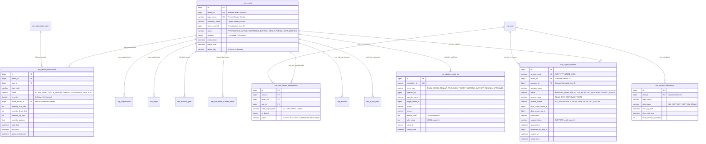

# Phase 6, 7, 11 & 12 Research — Combined Domain Model

## 1. Unified Entity-Relationship Diagram

```mermaid
erDiagram
    erp_tenant ||--o{ erp_tenant_subscription : "has subscriptions"
    erp_tenant ||--o{ erp_user_tenant_membership : "has user memberships"
    erp_tenant ||--o{ erp_organization : "owns organizations"
    erp_tenant ||--o{ erp_depot : "owns warehouses"
    erp_tenant ||--o{ erp_financial_year : "has fiscal years"
    erp_tenant ||--o{ erp_document_number_series : "has number series"
    erp_tenant ||--o{ erp_account : "has financial accounts"
    erp_tenant ||--o{ erp_in_out_item : "has in/out categories"
    erp_tenant ||--o{ erp_support_session : "receives support"
    erp_tenant ||--o{ erp_platform_audit_log : "tracked in audit logs"

    erp_subscription_plan ||--o{ erp_tenant_subscription : "defines template"
    erp_user ||--o{ erp_user_tenant_membership : "holds memberships"
    erp_user ||--o{ erp_support_session : "operator in support"
    erp_user ||--o{ erp_support_attendance : "logs attendance"

    erp_tenant {
        bigint id PK
        bigint tenant_id UK "Isolated Tenant Scope ID"
        varchar login_name UK "Primary Tenant Handle"
        varchar company_name "Legal Company Name"
        bigint admin_user_id "Tenant Admin User ID"
        varchar status "PROVISIONING, ACTIVE, SUSPENDED, EXPIRED, GRACE_PERIOD, SOFT_DELETED"
        tinyint enabled "1=Enabled, 0=Disabled"
        datetime create_time
        datetime expire_time
        varchar delete_flag "0=Active, 1=Deleted"
    }

    erp_support_session {
        bigint id PK
        varchar session_code UK "SUPP-YYYYMMDD-XXXX"
        bigint tenant_id FK "Customer Tenant ID"
        bigint operator_id FK "Support Specialist User ID"
        varchar operator_name
        varchar status "PENDING_APPROVAL, ACTIVE, REJECTED, REVOKED, EXPIRED, ENDED"
        varchar access_mode "READ_ONLY, APPROVED_WRITE"
        varchar module_scope "ALL_DIAGNOSTICS, INVENTORY, SALES, TAX_GST, etc."
        bigint data_scope_depot_id
        bigint data_scope_org_id
        varchar justification
        varchar support_token "SUPPORT_uuid_tenantId"
        datetime approved_at
        bigint approved_by_user_id
        datetime expires_at
        datetime create_time
    }

    erp_support_attendance {
        bigint id PK
        bigint user_id FK "Specialist User ID"
        varchar login_name
        varchar shift_status "ON_DUTY, OFF_DUTY, ON_BREAK"
        datetime clock_in_time
        datetime clock_out_time
        int total_sessions_handled
    }

    erp_platform_audit_log {
        bigint id PK
        varchar correlation_id UK
        varchar event_type "PLAN_ASSIGN, TENANT_PROVISION, TENANT_SUSPEND, SUPPORT_SESSION_APPROVED"
        bigint operator_id
        varchar operator_name
        bigint target_tenant_id
        varchar action
        varchar reason
        text before_state "JSON snapshot"
        text after_state "JSON snapshot"
        varchar client_ip
        datetime create_time
    }

    erp_tenant_subscription {
        bigint id PK
        bigint tenant_id FK
        bigint plan_id FK
        varchar plan_code
        varchar status "ACTIVE, TRIAL, GRACE_PERIOD, EXPIRED, SUSPENDED, REPLACED"
        tinyint is_active "1=Active, 0=Historical"
        bigint active_tenant_id UK "Virtual Generated Column"
        int override_user_limit
        int override_depot_limit
        int override_org_limit
        text override_features
        datetime start_date
        datetime end_date
        datetime grace_period_end
    }

    erp_user_tenant_membership {
        bigint id PK
        bigint user_id FK
        bigint tenant_id FK
        bigint role_id FK
        varchar data_scope_type "ALL, ORG, DEPOT, SELF"
        tinyint is_default
        varchar status "ACTIVE, INACTIVE, SUSPENDED, REVOKED"
    }
```
